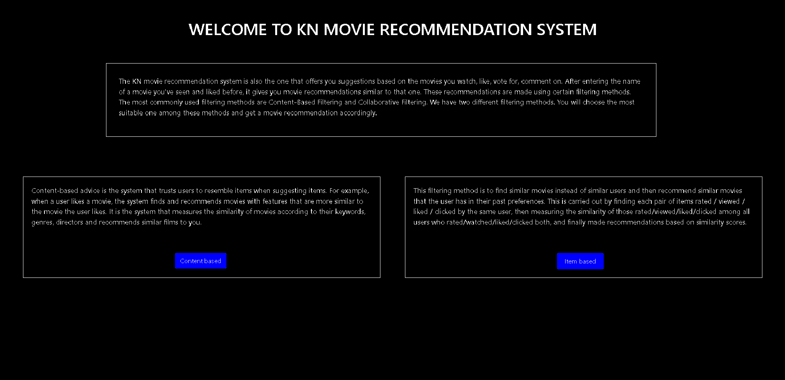
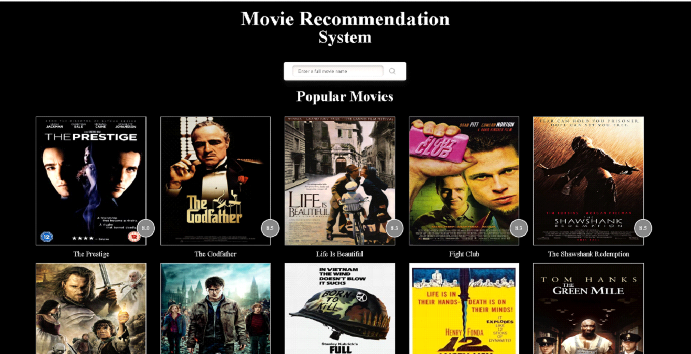
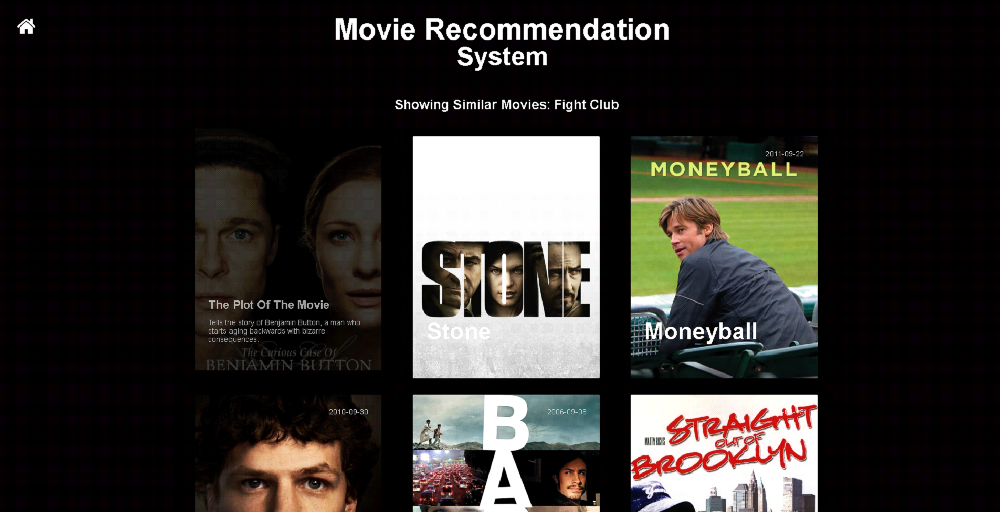

# KN-MovieRecommendationSystem
 The KN movie recommendation system is also the one that offers you suggestions based on the movies you watch, like, vote for, comment on.
 After entering the name of a movie you've seen and liked before, it gives you movie recommendations similar to that one.
 These recommendations are made using certain filtering methods.
 The most commonly used filtering methods are Content-Based Filtering and Collaborative Filtering.
 We have two different filtering methods.
 You will choose the most suitable one among these methods and get a movie recommendation accordingly.
 
 We used Python, Flask, HTML and CSS.
 
 ## Let's briefly describe the two filtering methods used in The KN movie recommendation system.
   * Content-based advice is the system that trusts users to resemble items when suggesting items. For example, when a user likes a movie, the system finds and recommends movies with features that are more similar to the movie the user likes. It is the system that measures the similarity of movies according to their keywords, genres, directors and recommends similar films to you.
   * Collaboravite İItem Based Filtering method is to find similar movies instead of similar users and then recommend similar movies that the user has in their past preferences.
This is carried out by finding each pair of items rated / viewed / liked / clicked by the same user, then measuring the similarity of those rated/viewed/liked/clicked among all users who rated/watched/liked/clicked both, and finally made recommendations based on similarity scores.

## Let me tell you a little bit about the methods we use to make this recommendation system.
   * We used the cosine similarity for the content based filtering method. Cosine similarity is a measure of the similarity between two non-zero vectors of an internal multiplication space. It is defined as equal to the cosine of the angle between them, and the length of both of these vectors is the same as the normalized internal product of 1. two non-zero vectors, but not in size. 
   * We used the KNN Algorithm for the collaboravite item based filtering method. K-Nearest Neighbor is one of the simplest Machine Learning algorithms based on the Supervised Learning technique. The K-NN algorithm assumes the similarity between new state/data and existing states and places the new state in the category that most similar to existing categories. The K-NN algorithm stores all existing data and classifies a new data point based on similarity. This means that when new data appears, it can be easily classified into a category of well packages using the K-NN algorithm.

## Data Sets Used
  * We used the Movielensin 100k dataset for the Collaboravite Item Based filtering method.

       [MovieLens 100K](https://grouplens.org/datasets/movielens/100k/)

  * We used TMDB's 5k data in Content Based. Since TMDB has its own API, we were also able to show the posters of our films on the result page.

       [TMDB 5K](https://www.kaggle.com/tmdb/tmdb-movie-metadata)

## Images

- Homepage

- Content Based Filter And Collaboravite Item Based Fiter Homepage

- Content Based Filter Result Page

- Calloboravite Item Based Filter Result Page

## Getting Started

  * download zip forder
  * unzip and open folder with any Python ide
  * download dependencies
  * run app.py
